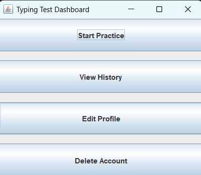
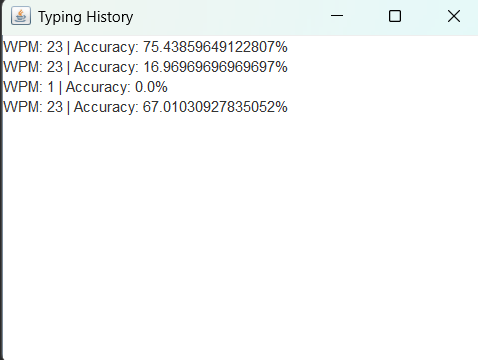

# ⌨️ Typing Speed Test Application (Java + JDBC)

A simple **Typing Speed Test Desktop Application** developed using **Java, Swing, and MySQL (JDBC)**.  
This project was created as a **mini project for Java Programming** to demonstrate **Object-Oriented Programming concepts and Database Connectivity**.

---

## 📌 Project Overview

The Typing Speed Test application allows users to:

- Practice typing with sample text
- Calculate typing speed (WPM)
- Store typing results in a **MySQL database**
- View past results

The project demonstrates **Java fundamentals, OOP concepts, and JDBC CRUD operations**.

---

## 🚀 Features

- 🧠 Random typing text
- ⏱ Typing speed calculation
- 💾 Store results in MySQL database
- 📊 View typing history
- 🖥 Simple Swing based UI
- 🔗 JDBC database connection

---

## 🛠 Technologies Used

| Technology | Purpose |
|-----------|--------|
| Java | Core programming language |
| Swing | GUI development |
| MySQL | Database |
| JDBC | Database connectivity |
| VS Code | Development environment |


---

## ⚙️ Setup Instructions

### 1️⃣ Install Requirements

Make sure the following are installed:

- **Java JDK 17 or above**
- **MySQL Server**
- **MySQL Connector JAR**
- **VS Code**

---

### 2️⃣ Create Database

Open **MySQL Workbench** or MySQL terminal and run:

```sql
CREATE DATABASE typing_app;

USE typing_app;

CREATE TABLE results (
    id INT AUTO_INCREMENT PRIMARY KEY,
    username VARCHAR(50),
    wpm INT,
    accuracy DOUBLE,
    test_date TIMESTAMP DEFAULT CURRENT_TIMESTAMP
);
3️⃣ Configure Database Connection

Edit the file:

database/DBConnection.java

Update your MySQL credentials:

private static final String USER = "root";
private static final String PASSWORD = "your_password";
4️⃣ Add MySQL Connector

Download:

mysql-connector-j-x.x.x.jar

Add it to your project folder.

Compile using:

javac -cp ".;mysql-connector-j-9.6.0.jar" *.java

Run using:

java -cp ".;mysql-connector-j-9.6.0.jar" Main

📸 Application UI

## Application Screenshots

### Login Page


### Dashboard


### Typing Test


### WPM Score


### History


### Edit Username


### Edit Password


### Updated MySQL Table


Example:

Typing Interface

Result Display

Database Records

👩‍💻 Author

Nelcy

Postgraduate Student
MSc Data Science
Christ University, Bangalore